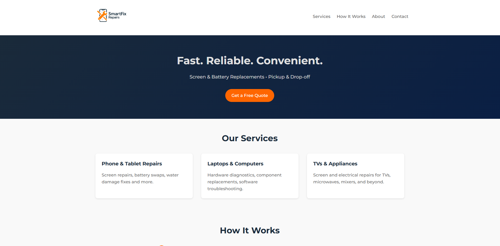

# SmartFix Repairs Website

A responsive static website developed for **SmartFix Repairs**, an electronics diagnostics and repair business serving customers in the Reading, Pennsylvania area.

The site presents available repair services, explains the repair process, provides business contact information, and includes an online quote-request form.



## Live Website

[Visit the SmartFix Repairs website](https://smartfix-repairs.com/)

## Project Overview

I created this website to provide SmartFix Repairs with a clear and accessible online presence. The site is designed to help customers understand the services offered, submit repair requests, and contact the business from desktop or mobile devices.

The website is built without a JavaScript framework or content-management system. It uses semantic HTML, custom CSS, Formspree for form submissions, and GitHub Pages for hosting.

## Features

- Responsive layout for desktop, tablet, and mobile devices
- Service descriptions for common electronics repairs
- Step-by-step explanation of the repair process
- Online quote-request form
- Clickable phone and email contact links
- Accessible navigation and form labels
- Keyboard-visible focus states
- Reduced-motion support
- Automated deployment through GitHub Actions

## Technologies Used

- HTML5
- CSS3
- Formspree
- GitHub Pages
- GitHub Actions
- Git and GitHub

## Repository Structure

```text
SmartFixRepairs/
├── .github/
│   └── workflows/
│       └── static.yml
├── assets/
│   └── images/
│       ├── logo.png
│       └── site-preview.png
├── css/
│   └── styles.css
├── .gitignore
├── index.html
└── README.md
```

## My Contributions

I designed and implemented the website with the assistance of ChatGPT, including:

- Page structure and semantic HTML
- Responsive CSS layout
- Business branding and visual styling
- Service and process content
- Quote-request form integration
- Accessibility improvements
- GitHub Pages deployment workflow
- Repository organization and documentation

## Quote Form

The quote form submits customer requests through Formspree. It collects:

- Customer name
- Email address
- Phone number
- Device and issue description
- Preferred service method

Submitting the form does not authorize a repair or guarantee a final price. Repair recommendations and pricing are confirmed separately after the request is reviewed.

## Deployment

The website is deployed through GitHub Pages.

Pushes to the `main` branch trigger the workflow located at:

```text
.github/workflows/static.yml
```

The workflow checks out the repository, uploads the static site files, and deploys them to GitHub Pages.

## Author

**Isaac Kremer**

Electrical and Computer Engineering student and founder of SmartFix Repairs.

- GitHub: [Ilkremer](https://github.com/Ilkremer)
- Repository: [SmartFixRepairs](https://github.com/Ilkremer/SmartFixRepairs)
